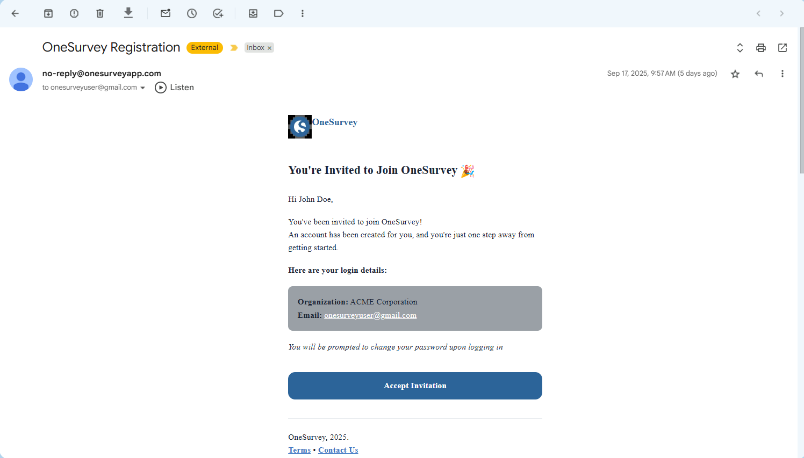
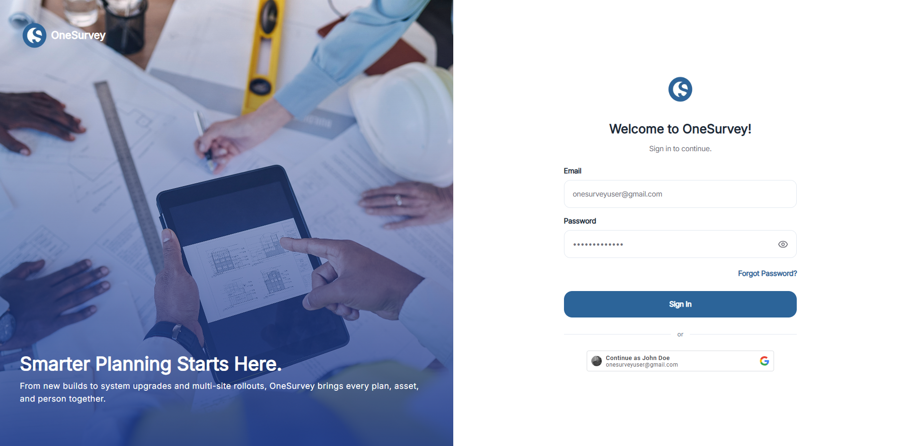

# Creating an Account

## 1. Receive an Invitation
An administrator sends an invite to your email.

  

    
  

Open the message and click the Join OneSurvey link.
The link opens a registration form in your browser.

## 2. Complete the Sign-Up Form
Provide the required details:

- Email 
- Password

Click Create Account. A confirmation message appears when your account is ready.

## 3. Log In for the First Time
Return to the login page.
Enter your email and the password you just created.
Click Log In to access the OneSurvey dashboard.

  

    
  

  
Login page for OneSurvey

## Troubleshooting
No invitation received? Check spam/junk folders or ask an administrator to resend the invite.
Forgot your password? Use the Forgot Password link on the login screen to reset it.
Invitation expired? Contact your administrator for a new invitation.

## Next Steps
Start your first project with the [Projects Overview](../projects/index.md).

