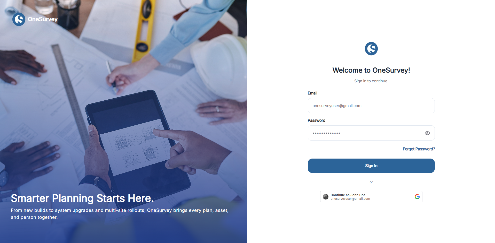
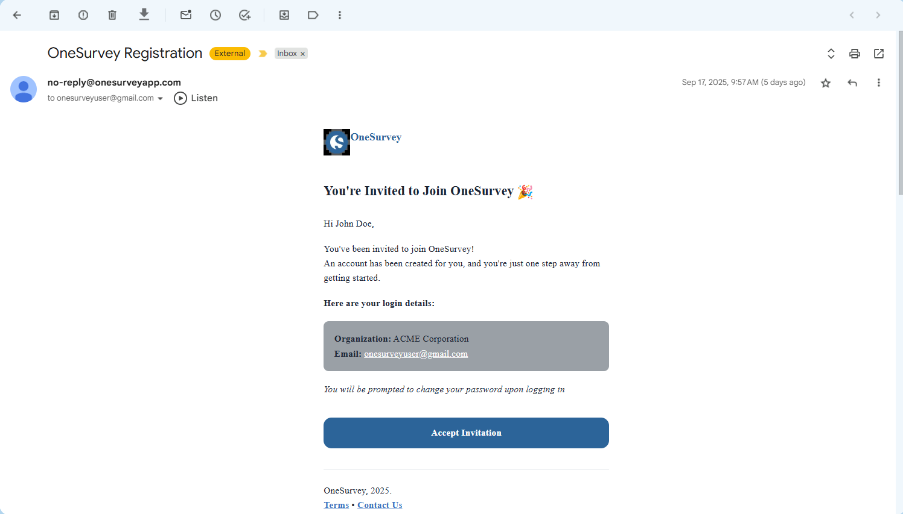

# Sign In and Invitations

## Overview

OneSurvey access is invitation-based. This page explains sign in, first-time setup, and what to do if you manage user invitations.

  

    
  

  
First-time account setup after accepting an invitation.

---

## Sign In

1. Open the OneSurvey login page.
2. Enter your email and password.
3. Select **Sign In**.

Notes:
- Use the eye icon to show or hide your password.
- If your organization enables Google sign-in, use **Continue with Google**.

If you cannot sign in, use [Password Reset](#password-reset).

---

## If You Manage Users: Send an Invitation

Available to: **Manager, Owner**

1. Open **Users**.
2. Select **Add User**.
3. Enter the person's email.
4. Choose **Seat Type** and **Org Role**.
5. Select **Send Invite**.

The person appears in the Users table with status **Invited**.

### Invitation Rules

- **Manager** and **Owner** roles require a **Full** seat.
- Only an existing **Owner** can assign the Owner role.
- If a seat limit is reached, the invite modal shows a capacity warning.
- If the email already belongs to an existing OneSurvey account, the user receives an organization join email.

### Pending Invites

From row actions on an invited user:
- **Resend invite**: sends a new invite email.
- **Revoke invite**: cancels the pending invitation.

---

## First-Time User Setup

1. Open the invitation email.
2. Select **Accept Invitation**.
3. Complete the required profile fields.
4. Set and confirm password.
5. Select **Complete Setup**.

After setup, you are signed in and sent to the Sites page.

  

    
  

  
Invitation email used to start setup.

---

## Joining Another Organization

If you already have a OneSurvey account and get invited to another organization:

1. Open the invitation email.
2. Select the organization link.
3. Sign in with your existing account.
4. Switch organizations with the organization selector if needed.

---

## Password Reset

1. On the login page, select **Forgot Password**.
2. Enter your email.
3. Open the reset email and use the link.
4. Enter and confirm your new password.
5. Sign in.

---

## Troubleshooting

| Problem | What to do |
|---|---|
| Invite email not received | Check spam or junk. Ask your account manager or owner to resend the invite. |
| Invite link expired | Ask for a new invitation email. |
| Invite link invalid | The invite may have been revoked. Ask for a new invite. |
| Cannot assign Owner role | Only an existing Owner can assign Owner. |
| Invite blocked by seat limit | Ask an owner or manager to free seats or increase capacity. |
| Signed in but missing expected sites | Switch to the correct organization using the organization selector. |

---

## Related Pages

- [Users and Roles](../organization/users.md)
- [Sites Overview](../sites/index.md)
- [FAQ](../support/faq.md)
