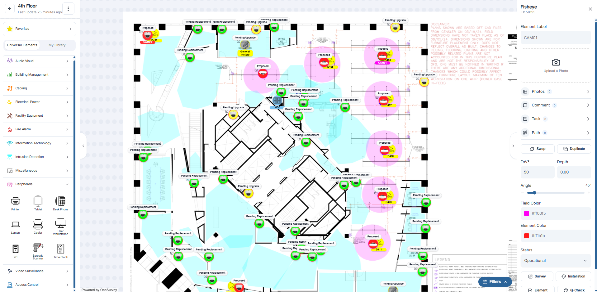

# OneSurvey Docs

Design smarter site surveys on floor plans. Capture photos. Collaborate. Turn work into proposals and reports — all in one place.

---

## Overview

Welcome to OneSurvey! 🚀 This platform is built to simplify the entire project workflow for technology and security systems—from site surveys to design, proposals, installation, and ongoing maintenance. With OneSurvey, you can design directly on floor plans by placing system elements, while also capturing key project data like progress photos, notes, and documentation. Everything is organized in one collaborative space, making it easier for teams to stay aligned, reduce errors, and deliver projects more efficiently. OneSurvey is trusted across industries such as those highlighted at [www.innovaaccelerator.com](https://www.innovaaccelerator.com), including technology, security, and facilities management.

  

    
  

<!-- 

  <a class="os-video-card" href="#" aria-label="Intro video placeholder">
    

      <svg width="26" height="30" viewBox="0 0 26 30" xmlns="http://www.w3.org/2000/svg">
        <polygon points="0,0 26,15 0,30"></polygon>
      </svg>
    

  </a>
  
Watch the OneSurvey overview (YouTube embed coming soon)

 -->

## Start Here

1. [Getting Started](getting-started/creating-account.md) - Account, login, and your first steps.
2. [Create a Project](projects/create-project.md) — Set up the hub for your site work.
3. [Start a Survey](surveys/start-survey.md) — Prepare floor plans and settings.
4. [Upload a Floor Plan](surveys/upload-floor-plan.md) — Add PDFs, images, or DWG exports.
5. [Canvas Basics](surveys/canvas-basics.md) — Pan, zoom, and place elements with confidence.

---

## What You Can Do

- Design directly on floor plans using a fast, browser-based canvas.
- Capture site photos and context, and link them to elements and rooms.
- Keep everything organized by project, with albums, tasks, and tickets.
- Generate clean reports and proposals from real survey data.
- Collaborate with teammates and clients while maintaining a full audit trail.

---

## Popular Guides

  

    <h4><a href="surveys/canvas-basics.md">Canvas Basics</a></h4>
    
Navigate, fit to screen, and reset rotation.

  

  

    <h4><a href="surveys/drag-and-drop.md">Drag &amp; Drop Elements</a></h4>
    
Place, align, and manage elements quickly.

  

  

    <h4><a href="surveys/visibility-filters.md">Visibility Filters</a></h4>
    
Focus on the devices and layers that matter.

  

  

    <h4><a href="surveys/version-history.md">Version History</a></h4>
    
Review and restore earlier canvas states.

  

  

    <h4><a href="media/project-photos.md">Project Photos</a></h4>
    
Capture, organize, and attach photos to your survey.

  

  

    <h4><a href="projects/reports.md">Reports</a></h4>
    
Export clean documentation from your survey data.

  

---

## Explore the Docs

- Surveys: [Overview](surveys/index.md), [Canvas Basics](surveys/canvas-basics.md), [Drag &amp; Drop](surveys/drag-and-drop.md), [Visibility Filters](surveys/visibility-filters.md), [Version History](surveys/version-history.md)
- Projects: [Overview](projects/index.md), [Project Detail](projects/project-detail.md), [Reports](projects/reports.md), [Proposals](projects/proposals.md), [Tasks](projects/tasks.md)
- Media: [OneSnap](media/onesnap.md), [Project Photos](media/project-photos.md), [Project Albums](projects/project-albums.md)
- Organization: [Overview](organization/index.md), [Users](organization/users.md), [Clients](organization/clients.md)
- Support: [FAQ](support/faq.md), [Glossary](support/glossary.md), [Support Tickets](support/tickets.md)

---

## Next Up

Ready to dive in? Start with [Getting Started](getting-started/creating-account.md), then open your first project and head to the [Canvas Basics](surveys/canvas-basics.md) guide to place your first elements.
