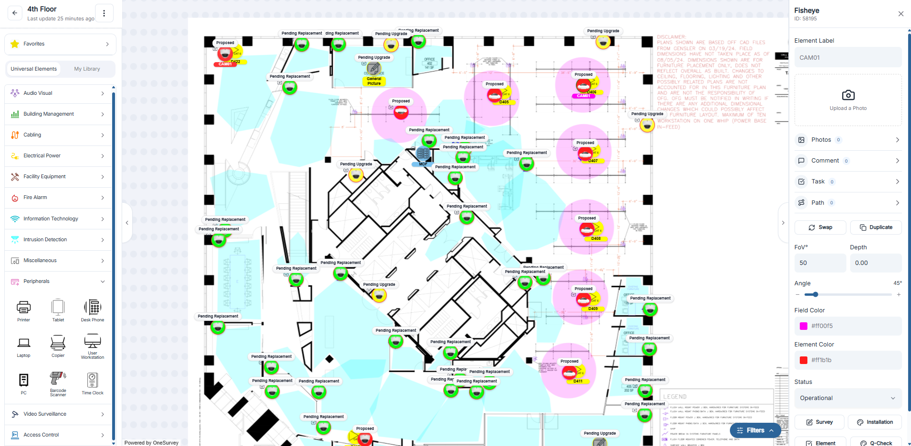

# OneSurvey Help Center

OneSurvey helps teams plan site work, document field conditions, and track execution in one connected workflow.

Use this Help Center to get started quickly and keep sites moving from setup to completion.

  

    
  

  
Workspace overview across surveys, sites, and field operations.

## Start with These Actions

  <a class="os-quick-link" href="sites/create-site/" role="listitem">Create a Site</a>
  <a class="os-quick-link" href="surveys/upload-floor-plan/" role="listitem">Upload a Floor Plan</a>
  <a class="os-quick-link" href="surveys/drag-and-drop/" role="listitem">Design &amp; Document</a>

For photo documentation during field work, use [Link Photos](surveys/link-photos.md). See the reference video below.

  

    <video controls preload="metadata" playsinline style="width: 100%; height: auto; display: block;" src="assets/videos/Tablet-Photo-Upload.mp4">
      Your browser does not support the video tag.
    </video>
  

  
Reference walkthrough for tablet photo upload during field work.

## What OneSurvey Helps You Do

- **Organize site work**: create and manage sites, teams, and site context.
- **Capture and document field conditions**: build surveys, place elements, and attach evidence.
- **Track execution**: manage assignments, tickets, and reporting status in one place.

## How It Works

1. Set up access and create a site.
2. Build or update the survey and document field conditions.
3. Track assignments and tickets, then review progress through reports.

## Browse by Area

  <section class="os-topic-card">
    <h3>Start Here</h3>
    
Get access set up and understand your first-day workflow.

    <ul>
      <li><a href="getting-started/creating-account/">Sign In and Invitations</a></li>
      <li><a href="support/access-and-roles/">Access and Roles</a></li>
      <li><a href="sites/">Sites Overview</a></li>
    </ul>
  </section>
  <section class="os-topic-card">
    <h3>Sites</h3>
    
Create sites and manage work from setup through delivery.

    <ul>
      <li><a href="sites/create-site/">Create a Site</a></li>
      <li><a href="sites/site-detail/">Site Detail</a></li>
      <li><a href="sites/reports/">Reports</a></li>
    </ul>
  </section>
  <section class="os-topic-card">
    <h3>Surveys</h3>
    
Build floor plans, place elements, and capture documentation.

    <ul>
      <li><a href="surveys/upload-floor-plan/">Upload a Floor Plan</a></li>
      <li><a href="surveys/drag-and-drop/">Drag and Drop Elements</a></li>
      <li><a href="surveys/link-photos/">Link Photos</a></li>
    </ul>
  </section>
  <section class="os-topic-card">
    <h3>Mobile</h3>
    
Capture updates quickly while working in the field.

    <ul>
      <li><a href="mobile/">Mobile Overview</a></li>
      <li><a href="mobile/sites/">Sites on Mobile</a></li>
      <li><a href="mobile/assignments-tickets/">Assignments and Tickets</a></li>
    </ul>
  </section>
  <section class="os-topic-card">
    <h3>Organization and Access</h3>
    
Manage users, clients, and organization-level settings.

    <ul>
      <li><a href="organization/users/">Users and Roles</a></li>
      <li><a href="organization/clients/">Clients</a></li>
      <li><a href="organization/">Organization Settings</a></li>
    </ul>
  </section>
  <section class="os-topic-card">
    <h3>Help</h3>
    
Find answers, terms, and product updates fast.

    <ul>
      <li><a href="support/faq/">FAQ</a></li>
      <li><a href="support/glossary/">Glossary</a></li>
      <li><a href="support/release-notes/">Release Notes</a></li>
    </ul>
  </section>

## Access Note

What you see in OneSurvey depends on your role and seat type. See [Access and Roles](support/access-and-roles.md) for details.

## Related Pages

- [Sign In and Invitations](getting-started/creating-account.md)
- [Users and Roles](organization/users.md)
- [Sites Overview](sites/index.md)
- [Surveys Overview](surveys/index.md)
- [FAQ](support/faq.md)
