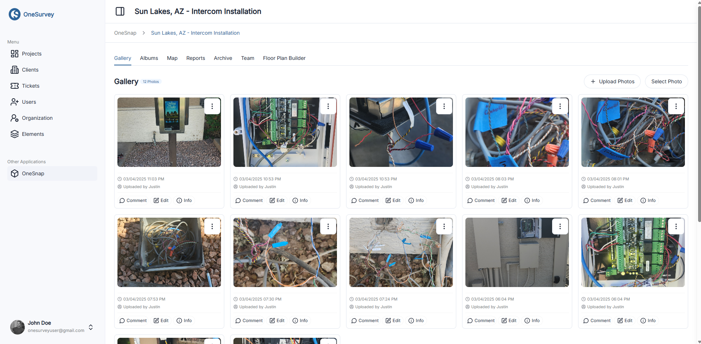
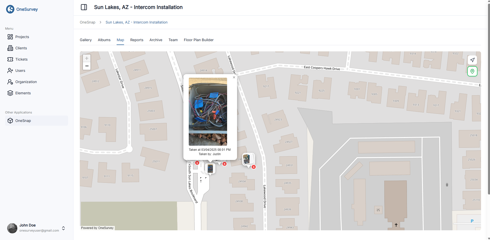

# OneSnap

## Overview
OneSnap is a fast photo workflow for field capture, organization, and review.

  

    
  

  
OneSnap gallery for high-volume field photo capture.

## Session Tabs
- Gallery
- Albums
- Map
- Reports
- Archive
- Floor Plan Builder (coming soon)

## What Teams Do in OneSnap
- Capture and review photos in Gallery.
- Group photos in Albums.
- Review location context in Map.
- Generate share-ready outputs in Reports.
- Move old content to Archive.

  

    
  

  
Map context with geotag support for captured photos.

## Sharing and Access
- Session access can be managed per user inside OneSnap.
- Available actions vary by your role/seat and session access.

## Notes
Floor Plan Builder currently shows as a maintenance/coming-soon area.

## Related Pages
- [Gallery](../sites/gallery.md)
- [Mobile OneSnap](../mobile/onesnap.md)

