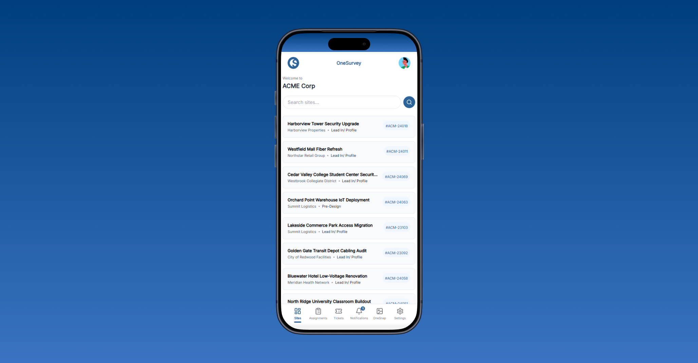

# Mobile Sites

## Overview
**Mobile Sites** is the starting point for field work in the OneSurvey mobile app. Use it to find the right site quickly, open site details, and move into surveys, tickets, assignments, attachments, or site information based on your access.

  

    
  

  
Mobile site list with search, stage, client, and site number details.

## Find and Open a Site

1. Open the mobile app and go to **Sites**.
2. Use **Search sites** when you need to find a specific site faster.
3. Tap the site row to open site details.

Each site row shows:

- The site name.
- The primary client name.
- The current site stage.
- The site number.

If you have many sites, keep scrolling to load more.

## Site Detail Tabs

When you open a site, it starts on the **Surveys** tab. From the site detail view you can move into:

- **Surveys** to open a survey and work on element updates in the field.
- **Tickets** to review or manage site issues.
- **Assignments** to review linked work items when assignments are available for your role.
- **Attachment** to review files attached to the site.
- **Info** to review or update site address and contact details.

## Access Differences

Available tabs change based on project access:

- All mobile site users can access **Surveys** and **Tickets**.
- **Assignments** appears when your access includes assignments, which is typically available to **Full members** and **Field members**.
- **Attachment** and **Info** are available to **Full members**, including Members, Managers, and Owners with a Full seat.
- In **Info**, **Full members** can update the site address and manage site contacts.

## Typical Mobile Flow

1. Search for and open the site you are working on.
2. Start in **Surveys** if you need to update field conditions or photos.
3. Open **Tickets** or **Assignments** when you need to track follow-up work.
4. Use **Info** or **Attachment** if you need site reference details and your access allows it.

## Related Pages
- [Mobile Surveys](surveys.md)
- [Assignments and Tickets](assignments-tickets.md)

