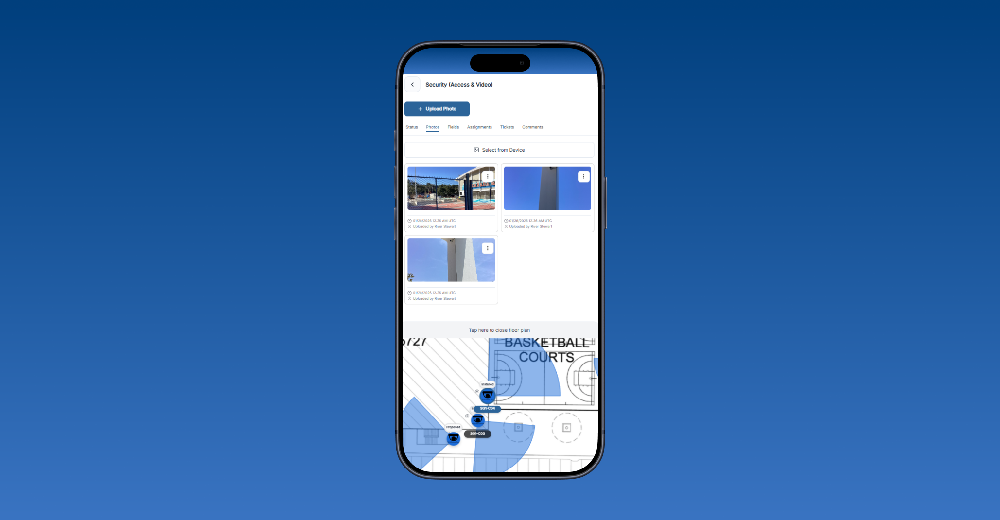

# Mobile Surveys

## Overview
**Mobile Surveys** is built for fast field updates when you are standing on site and need to confirm element status, add photos, review issues, or leave notes without going back to desktop.

  

    
  

  
Mobile survey view with the element list and quick access to element details.

## Open a Survey

1. Open the site from the mobile site list.
2. Stay on the **Surveys** tab in the site detail view.
3. Tap the survey card you want to work in.

Each survey card shows the survey name, a preview image, and the most recent update time.

## What You See in a Mobile Survey

The survey opens as an element list designed for fast updates in the field. Each row shows:

- The element name and number.
- The current label value.
- The current status.
- Counts for linked photos and comments.
- Assignment counts when assignments are available for your access level.

Tap any element to open its detail view. If you need floor plan context, expand the floor plan panel at the bottom of the screen.

## Working with an Element

Depending on your access, the element detail view can include:

- **Status** to update installation status and operational status.
- **Photos** to review linked images and, when allowed, capture or upload new ones.
- **Fields** to update element-specific data fields, part numbers, and accessories.
- **Assignments** to review linked assignments when assignment access is available.
- **Tickets** to review or manage issue records tied to the selected element.
- **Comments** to add field notes and keep discussion attached to the element.
- **OneSafe** for protected element information in viewer-oriented workflows.

## Photo Actions on Mobile

In the **Photos** tab you can:

- Tap **Upload Photo** to open the device camera.
- Tap **Select from Device** to attach one or more saved images.
- Tap a photo to open it in the full-screen viewer.
- Use the photo actions menu to annotate a photo when photo management is available to your role.

## Access Differences

Mobile Surveys is access-aware, so available tabs and actions change based on the seat and site access you have:

- **Full members** and **Field members** typically see **Status**, **Photos**, **Fields**, **Assignments**, **Tickets**, and **Comments**.
- **Viewer members** focus on **Photos**, **OneSafe**, **Tickets**, and **Comments**.
- **Viewer members** do not see photo upload controls or status and field editing.

## Typical Field Flow

1. Open the site and select the correct survey.
2. Tap the element you are working on from the mobile list.
3. Update status or fields as needed.
4. Add photos, comments, or tickets while you are at the element.
5. Return to the list and continue to the next item.

## Related Pages
- [Mobile Sites](sites.md)
- [Link Photos](../surveys/link-photos.md)
- [Mobile Assignments and Tickets](assignments-tickets.md)
- [Field Tips](field-tips.md)

