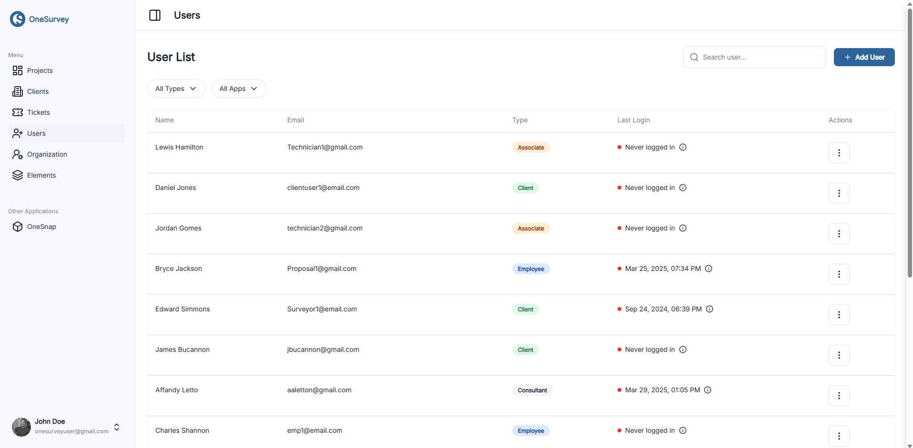

---
audience: public-end-user
roles:
  - manager
  - owner
last_reviewed: 2026-02-27
doc_owner: Docs Team
---

# Users and Roles

## Overview

Available to: **Manager, Owner**

Use the **Users** page to invite people, set access, and track seat usage.

  

    
  

  
Users page for invitations, role assignment, and seat tracking.

## Role and Seat Basics

### Organization Role

| Role | Typical responsibility |
| --- | --- |
| Owner | Full organization authority, including assigning Owner access. |
| Manager | Manages users and operations across the organization. |
| Member | Works in sites based on seat type and project access. |

### Seat Type

| Seat | Typical usage |
| --- | --- |
| Full | Full planning and editing workflows. |
| Field | Field execution workflows and updates. |
| Viewer | View and comment access with limited editing. |

Manager and Owner roles require a Full seat.

## Invite a User

1. Open **Users**.
2. Select **Add User**.
3. Enter email.
4. Choose seat type and role.
5. Select **Send Invite**.

## Invitation Status

- New invitees show as **Invited** until setup is complete.
- Use row actions to **Resend invite** or **Revoke invite**.
- Existing OneSurvey users receive a join email for your organization.

## Update Access

1. Open row actions and select **Edit**.
2. Update role and seat.
3. Save.

Important behavior:
- Only existing owners can assign Owner access.
- The last owner in an organization cannot be demoted.
- Access updates apply immediately.

## Remove a User

Use row actions and select **Delete**.

What happens:
- If the person belongs only to your organization, their user record is removed.
- If they belong to multiple organizations, they are removed from your organization only.

## Seat Usage

The page shows Full, Field, and Viewer usage against seat limits so you can manage capacity before inviting more users.

## Related Pages

- [Organization Settings](index.md)
- [Audit Logs](audit-logs.md)
- [Sign In and Invitations](../getting-started/creating-account.md)
