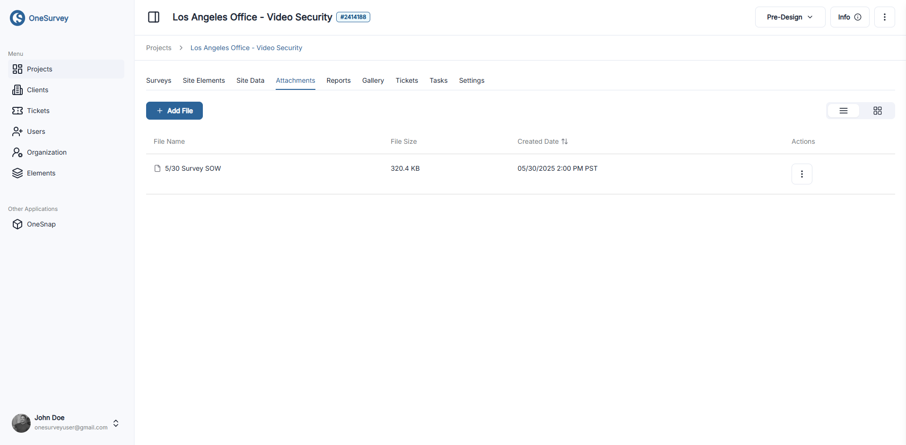

# Attachments

The Attachments tab centralizes project files, allowing teams to upload, preview, rename, or remove supporting documents in either a table or grid layout.

  

    
  

## Upload Files

- Click Add File to open the upload modal and select a document from your device.
- Fill in the file name and confirm to attach it to the project.

## View Modes

Switch between Table and Grid layouts with the view toggle, letting you browse files by metadata or thumbnail preview.

### Table View

Displays file name, size, creation date, and action controls for renaming or deleting files.

### Grid View

Shows each attachment as a card with a thumbnail (for images) and a menu for rename or delete actions.

---

These tools help keep project documentation organized, ensuring files remain accessible throughout the project lifecycle.

See also: [Reports](reports.md)
