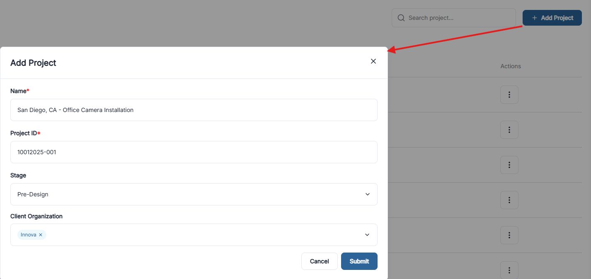

---
audience: public-end-user
roles:
  - member
  - manager
  - owner
last_reviewed: 2026-02-27
doc_owner: Docs Team
---

# Create a Site

## Overview

A **Site** is the central workspace for work in OneSurvey. Surveys, media, assignments, tickets, and reports are all organized under a site.

  

    
  

  
Create a site from the Add Project modal.

---

## Available to

- Create site: **Full seat** users.
- Manage site team: **Manager, Owner**.

If **Add Project** is not visible, your current access does not allow site creation.

---

## Create a Site

1. Open **Sites**.
2. Select **Add Project**.
3. Complete the form.
4. Select **Submit**.

### Site Form Fields

| Field | Required | Description |
|---|---|---|
| **Name** | Yes | Display name for the site. |
| **Project ID** | Yes | Short identifier for the site. Spaces are converted to hyphens. |
| **Stage** | No | Current lifecycle stage. |
| **Client Organization** | No | Links the site to a client record. |

### Stage Options

| Stage | Description |
|---|---|
| **Lead in/Profile** | Initial profile and scoping. |
| **Pre-Design** | Survey and assessment phase. |
| **Take Off** | Quantity and scope takeoff. |
| **Design** | Active design work. |
| **Deployment** | Installation or deployment phase. |
| **LiveBuilt** | Final as-built documentation. |

---

## Manage Site Team

Available to: **Manager, Owner**

1. In the Project List, select the team avatar stack (or **+**) for a site.
2. Search users by name or email.
3. Add people to the invite list.
4. Set project access level.
5. Select **Save**.

### Project Access Levels

| Access Level | Intended users | What they can do |
|---|---|---|
| **Edit** | Full seat users | Full survey and project actions. |
| **Restricted Edit** | Field seat users | Field updates and photo workflows; limited design actions. |
| **View** | Viewer seat users | View and comment only. |

### Seat-Based Limits

- Full seat: Edit, Restricted Edit, or View.
- Field seat: Restricted Edit or View.
- Viewer seat: View only.
- Owner and Manager organization roles are always locked to **Edit**.

---

## Manage Existing Sites

Available to: **Manager, Owner** (for menu actions)

From the row action menu in Project List:
- **Edit**: update site details.
- **Copy Project**: duplicate a site and its content.
- **Archive Site / Unarchive Site**: move sites in or out of active views.

### Update Stage from List

Available to: **Full seat** users

Click the stage value in the **Stage** column to change stage directly.

---

## Next Steps

1. Add your first survey.
2. Assign team members.
3. Review site elements and data.
4. Capture photos with Gallery or OneSnap.
5. Track work with assignments and tickets.

---

## Related Pages

- [Site Detail](project-detail.md)
- [Surveys Overview](../surveys/index.md)
- [Gallery](gallery.md)
- [Assignments](assignments.md)
- [Tickets](tickets.md)
- [Clients](../organization/clients.md)
