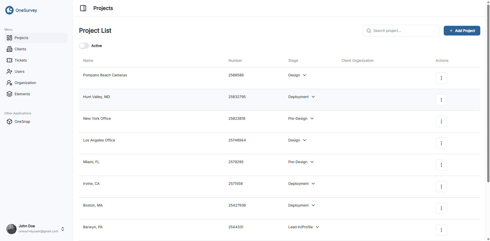

# Project Overview

Projects are the core workspace in OneSurvey, bringing together every detail about a site, from its floor plans and system elements to photos, documents, and tasks. Each project acts as a central hub where teams can collaborate, track progress, and prepare for installation or maintenance.

  

    
  

  
List of projects that have been created

## Project Lifecycle
- Create a Project: Start from the Projects dashboard and define a name, description, and client information.
- Add Site Details: Upload relevant floor plans, notes, or reference materials.
- Collect Data: Capture photos, attach documents, and record survey information.
- Review & Share: Generate reports, share access with stakeholders, or export data for downstream systems.

## Key Tabs & Features
- Project Albums: Organize and browse photos grouped by album.
- Project Photos: Manage individual images with metadata and annotations.
- Attachments: Store documents such as drawings, PDFs, or spreadsheets.
- Gallery: View all visual assets in a unified grid.
- Proposals: Draft and refine scope-of-work documents.
- Reports: Generate formal reports from collected data.
- Site Data: Record measurements, coordinates, or other field notes.
- Site Elements: Place and manage system elements on floor plans.
- Site Settings: Configure project metadata, permissions, and defaults.
- Tasks: Assign, track, and resolve action items.
- Tickets: Log issues or requests tied to the project.

## Navigation Tips
- Use the Projects navigation menu to switch between active projects.
- The sidebar lists all tabs; click a tab name to reveal its content.
- Global search helps quickly jump to albums, photos, or tasks.
- Breadcrumbs at the top of each page show where you are within a project's hierarchy.

## Next Steps
Once you've familiarized yourself with the overview, explore the focused guides for each tab, starting with [Creating a Project](create-project.md) and [Project Albums](project-albums.md), to dive deeper into the functionality available within a project.

