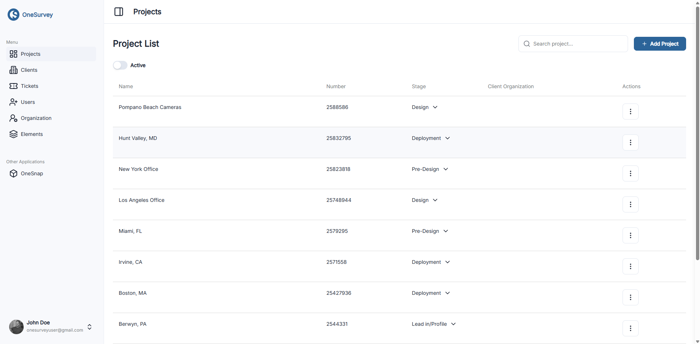

# Sites Overview

Sites are the central workspace for planning, field execution, media capture, and final handoff.

  

    
  

  
Sites list with stage, team, and quick actions.

## Most Used

  <a class="os-quick-link" href="create-project/" role="listitem">Create a Site</a>
  <a class="os-quick-link" href="project-detail/" role="listitem">Site Detail</a>
  <a class="os-quick-link" href="gallery/" role="listitem">Gallery</a>
  <a class="os-quick-link" href="assignments/" role="listitem">Assignments</a>
  <a class="os-quick-link" href="tickets/" role="listitem">Tickets</a>
  <a class="os-quick-link" href="reports/" role="listitem">Reports</a>

## Guides by Topic

  <section class="os-topic-card">
    <h3>Planning and Setup</h3>
    
Create site records, manage key details, and establish structured data.

    <ul>
      <li><a href="create-project/">Create a Site</a></li>
      <li><a href="project-detail/">Site Detail</a></li>
      <li><a href="site-elements/">Site Elements</a></li>
      <li><a href="site-data/">Site Data</a></li>
    </ul>
  </section>
  <section class="os-topic-card">
    <h3>Media and Deliverables</h3>
    
Capture evidence, store files, and generate reports for delivery.

    <ul>
      <li><a href="gallery/">Gallery</a></li>
      <li><a href="attachments/">Attachments</a></li>
      <li><a href="reports/">Reports</a></li>
      <li><a href="../media/onesnap/">OneSnap Overview</a></li>
    </ul>
  </section>
  <section class="os-topic-card">
    <h3>Execution and Follow-up</h3>
    
Track install work and service requests throughout project lifecycles.

    <ul>
      <li><a href="assignments/">Assignments</a></li>
      <li><a href="tickets/">Tickets</a></li>
      <li><a href="../support/faq/">FAQ</a></li>
    </ul>
  </section>

## Related Pages
- [Surveys Overview](../surveys/index.md)
- [Mobile Overview](../mobile/index.md)
- [Users and Roles](../organization/users.md)
- [Release Notes](../support/release-notes.md)
