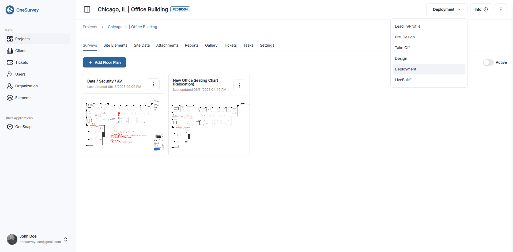

# Project Detail

The Project Detail page is your central command center for everything related to a single job. Once a project is created, this page consolidates all floor plans, photos, documents, tasks, and other data so teams can coordinate from one place.

  

    
  

  
Project details menu

## Accessing a Project
- From the Projects dashboard, click the project name or open the context menu and choose View Project.
- You'll be taken to the Project Detail page, with the project title and key metadata at the top (client, address, status, etc.).

## Key Tabs & Features
Each tab focuses on a specific aspect of the project:

### Project Albums
 
- See also: [Project Albums](project-albums.md) and [Album Detail](../media/project-album-detail.md)
Group photos into themed collections (e.g., "Pre-Install Walkthrough"). Albums make it easy to share or review sets of images.

### Project Photos
 
- See also: [Project Photos](project-photos.md) and [OneSnap Mobile Capture](../media/onesnap.md)
Browse every image captured for the project. Add metadata, annotations, or tags to keep photos organized and searchable.

### Attachments
Store supporting files such as blueprints, diagrams, inspection reports, or spreadsheets in one place. Upload new documents or download existing ones for reference.

### Gallery
A visual grid of all photos and albums combined, ideal for quickly scanning through site imagery.

### Proposals
Draft and refine statements of work or installation plans. Proposals can be exported or shared with stakeholders for approval.

### Reports
 
- See also: [Reports](reports.md)
Generate formal reports based on collected data. Customize the output to include photos, site notes, or specific elements.

### Site Data
Record measurements, coordinates, or other field notes. This tab centralizes survey data that doesn't belong on floor plans.

### Site Elements
 
- Related: [Drag and Drop](../surveys/drag-and-drop.md) and [Visibility Filters](../surveys/visibility-filters.md)
Place and manage system components (e.g., cameras, sensors) directly on floor plans. Each element can carry configuration details or installation notes.

### Site Settings
 
- See also: [Site Settings](site-settings.md)
Configure project metadata, default permissions, or naming conventions. You can adjust project-level settings at any time.

### Tasks
Assign action items, track progress, and resolve outstanding work. Tasks help teams stay aligned and accountable.

### Tickets
Log issues or requests tied to the project (e.g., "Need updated floor plan"). Tickets track problem resolution and communication history.

## Tips & Best Practices
- Use the Tabs Strategically: Encourage team members to store information in the most relevant tab (e.g., photos in Albums, documents in Attachments) to maintain clarity.
- Leverage Permissions: Site Settings let you control who can view or edit each section, ensuring sensitive data stays protected.
- Search & Filter: Many tabs include search or filter tools, so take advantage of them to quickly locate specific files, photos, or elements.

## Next Steps
- Return to [Create a Project](create-project.md) if you haven't set one up yet.
- Explore [Project Albums](project-albums.md) and [Project Photos](project-photos.md) for deeper guidance on managing visual content.
- Continue to [Site Elements](site-elements.md) to learn how to place devices on floor plans.

