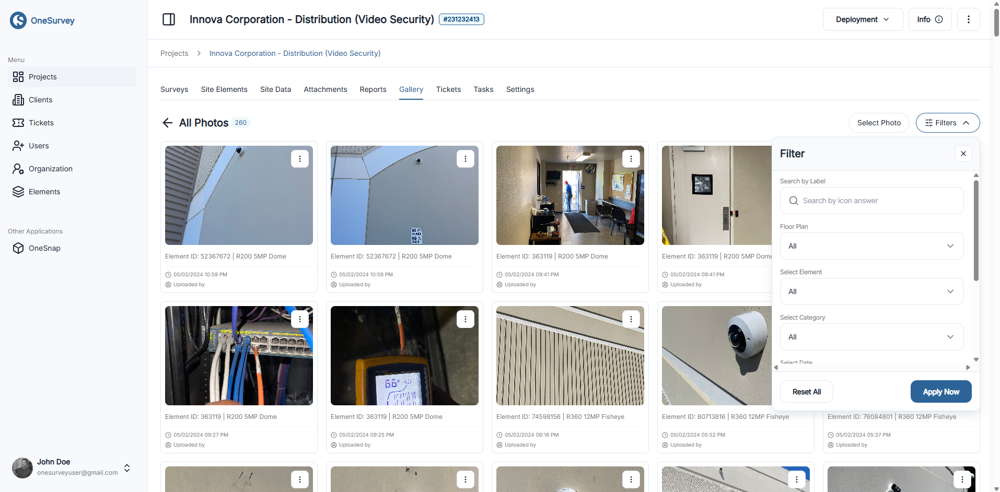

# Project Photos

The Project Photos view lists every image associated with the project, regardless of album. Use it to filter, select, and organize photos before placing them into albums or generating reports.

  

    
  

## Main Features

- Select Mode — enable to pick individual photos for bulk actions.
- Create Album — after selecting photos, assemble them into a new album.
- Select All / Unselect All — quickly highlight or clear multiple photos.
- Filter dropdown — narrow results by date or metadata fields.
- Photo cards — each thumbnail supports selection; a badge shows total photo count.

If no photos match your filters, a clear “No Photos Found” message lets you adjust criteria or upload new images.

## Organizing Photos

1. Use filters to locate the set you need.
2. Enable Select Mode and choose photos.
3. Click Create Album to group them. Manage the new album under [Project Albums](project-albums.md).

Tips:

- Keep photos labeled consistently to improve filtering and report clarity.
- Use albums for stakeholder updates (e.g., weekly progress) and export PDFs when needed.

Related: [Project Albums](project-albums.md), [OneSnap](../media/onesnap.md), [Reports](reports.md)
