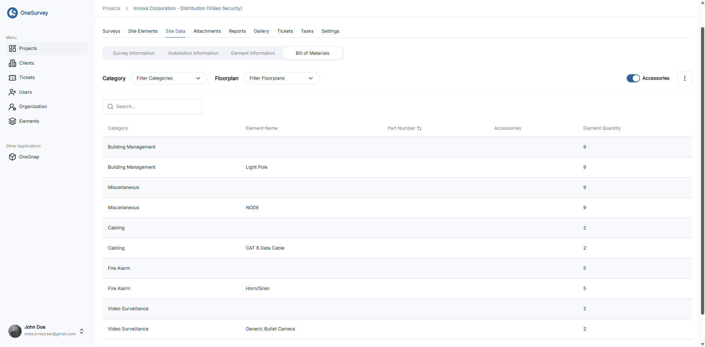

# Site Data

Site Data consolidates every detail collected during surveys into a set of structured tables. Each tab focuses on a different slice of information, with filters, search, and export tools to help you refine and share what you need.

  

    
  

---

## Tabs at a Glance

### 1. Survey Information
Tracks each survey element and its metadata.

- Key features
  - Search by floor plan name, element ID, label, location, height, mounting surface, or labor cost.
  - Filters
    - Element Name: narrow to a specific element type.
    - Status: e.g., Existing, New, Remove.
    - Category: filter by element category (cameras, sensors, etc.).
  - Table with pagination and rows-per-page controls.
  - Three-dot menu
    - Save Spreadsheet Report: queues a spreadsheet export.
    - Save PDF Report: queues a PDF export, available later in the Reports tab.

### 2. Installation Information
Summarizes who installed each element and what type of work was done.

- Key features
  - Search by floor plan names.
  - Filters
    - Element Name: filter by specific elements.
    - Installed By: show elements assigned to a particular installer.
    - Type of Necessary Technology: filter by technology category.
  - Table with pagination and rows-per-page controls.
  - Three-dot menu
    - Save Spreadsheet Report
    - Save PDF Report
  - Both exports can be retrieved from the Reports tab once generated.

### 3. Element Information
Provides granular details about each element, including part numbers and classifications.

- Key features
  - Search by floor plan names.
  - Filters
    - Element Name: pick a specific element.
    - Classification: filter by classification tag.
  - Table with pagination and rows-per-page controls.
  - Three-dot menu & modals
    - Save Spreadsheet Report
    - Save PDF Report
    - Edit Part Number: bulk add or edit part numbers; calculates total price.
    - Edit Accessories: bulk toggle accessory options via checkboxes.
    - Edit Fields: reorder or enable/disable custom metadata fields.
    - Edit Classifications: assign or modify classification tags.
    - Update Latest: shows a loading overlay while refreshing data.
  - Reports created here also appear under [Reports](reports.md).

### 4. Bill of Materials
Generates a cost and equipment breakdown for the project.

- Key features
  - Filters
    - Classification: multi-select checkbox list.
    - Floor plan: multi-select checkbox list.
    - Accessories toggle: include or exclude accessories in the results.
  - Search by type, element name, or part number.
  - Dropdown filters for Type and Element.
  - Table with pagination and rows-per-page controls.
  - Three-dot menu
    - Save PDF Report: exports the current bill of materials; download from [Reports](reports.md) once ready.

---

## Using the Three-Dot Menu (⋮)
Each tab’s upper-right corner includes a three-dot icon that opens an action menu. Common options like Save Spreadsheet Report and Save PDF Report queue exports; more advanced actions (for example, Edit Part Number) open modals for bulk updates. When an export is triggered, OneSurvey confirms the action and makes the file available in the [Reports](reports.md) section once processing completes.

With Site Data, you can slice, refine, and share survey information without leaving the project workspace—ensuring every stakeholder has the details they need.
