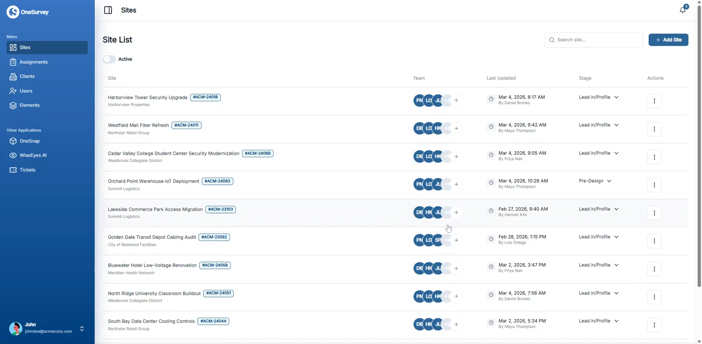

# Sites Overview

Sites are the central workspace for planning, field execution, media capture, and final handoff.

  

    
  

  
Sites page overview with stage, team, and quick actions.

## Most Used

  <a class="os-quick-link" href="create-site/" role="listitem">Create a Site</a>
  <a class="os-quick-link" href="site-detail/" role="listitem">Site Detail</a>
  <a class="os-quick-link" href="gallery/" role="listitem">Gallery</a>
  <a class="os-quick-link" href="assignments/" role="listitem">Assignments</a>
  <a class="os-quick-link" href="tickets/" role="listitem">Tickets</a>
  <a class="os-quick-link" href="reports/" role="listitem">Reports</a>

## Site Workflows

  <article class="os-card">
    <h4>Set Up Site Records</h4>
    
Create the site and confirm key details before field work starts.

    
<a href="create-site/">Create a Site</a> · <a href="site-detail/">Site Detail</a>

  </article>
  <article class="os-card">
    <h4>Capture Field Evidence</h4>
    
Keep media organized and ready for handoff deliverables.

    
<a href="gallery/">Gallery</a> · <a href="attachments/">Attachments</a> · <a href="../media/onesnap/">OneSnap</a>

  </article>
  <article class="os-card">
    <h4>Track Work to Completion</h4>
    
Manage execution tasks, issues, and final report output in one flow.

    
<a href="assignments/">Assignments</a> · <a href="tickets/">Tickets</a> · <a href="reports/">Reports</a>

  </article>

## Related Pages
- [Surveys Overview](../surveys/index.md)
- [Mobile Overview](../mobile/index.md)
- [Users and Roles](../organization/users.md)
- [Release Notes](../support/release-notes.md)
