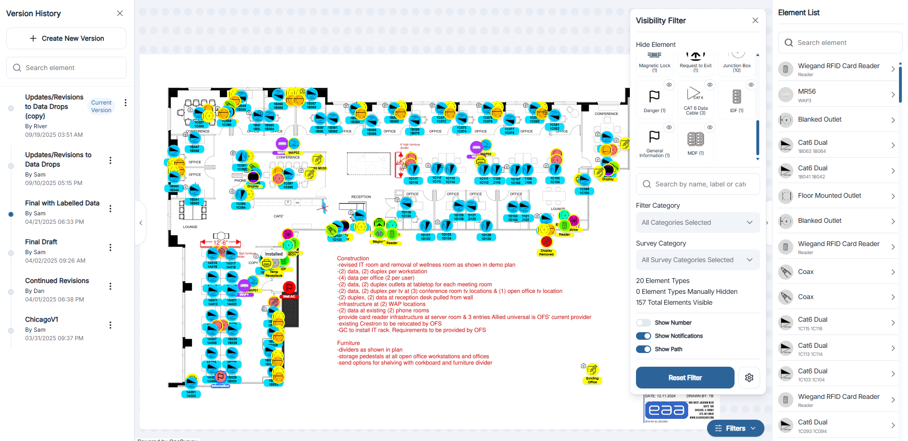

# Canvas Basics

The canvas is where surveys come to life. Here, you can view floor plans, place system elements, and refine their layout without leaving the browser. This page covers the essential navigation and tools you'll use in the canvas workspace.

  

    
  

## Floor Plan Area

The central workspace displays the current floor plan or background image.

- A toolbar along the right side provides element palettes, styling options, and mini popups for metadata.
- The left sidebar shows plan selection and related context.

## Navigating the Canvas

| Action | Shortcut/Method |
| --- | --- |
| Pan | Click-and-drag with the mouse or touchpad. |
| Zoom | Scroll wheel, trackpad pinch, or double-click |
| Fit to Screen | Click the Fit icon to center and scale the Open up the visibility filter, and click the center icon. |

## Switching Floor Plans

- Open the Floor Plans dropdown in the left sidebar.
- Choose another plan to instantly swap the background while keeping existing elements visible.
- Use the Upload Floor Plan button when you need to add a new layout. See Uploading for details: [Upload Floor Plan](upload-floor-plan.md).

## Element Layer Controls

- Toggle visibility filters to show or hide specific element categories. Learn more: [Visibility Filters](visibility-filters.md).
- Use the search bar to locate elements by name or ID.
- Layer order is automatically managed, but you can drag elements forward or backward with the context menu.

## Working with Elements

- Drag & Drop items from the left toolbar onto the canvas. See: [Drag & Drop Elements](drag-and-drop.md).
- Click an element to open mini popups for:
  - [Design](design.md): rename, add labels, or adjust position.
  - [Color & Styling](color-styling.md): change color, size, or icon.
  - [Element Information](element-information.md): add descriptions, notes, or linked files.
  - [Installation Access](installation-access.md): capture access details or special instructions.

## Version History

Access Version History from the left toolbar to review and restore earlier canvas states. Each snapshot records the positions and attributes of all elements, providing an audit trail as designs evolve. Learn more: [Version History](version-history.md).

## Tips

- Combine zoom/pan with visibility filters to focus on specific Elements.
- Save versions frequently before making major changes.

## Next Steps

- Learn about [Drag & Drop Elements](drag-and-drop.md) for detailed placement tips.
- Explore [Visibility Filters](visibility-filters.md) to declutter the view.
- Visit [Version History](version-history.md) for deeper rollback and restoration instructions.

