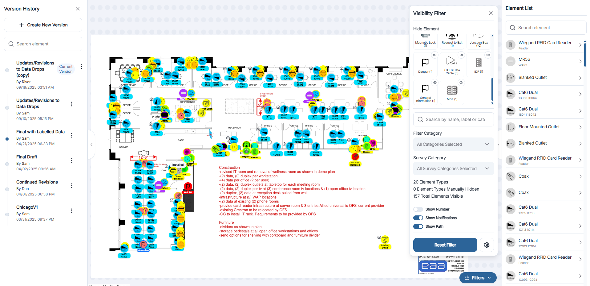

# Canvas Basics

## Overview
The canvas is the main survey workspace for placing and updating elements.

  

    
  

  
Canvas workspace for placing and editing survey elements.

## Core Actions
- Pan and zoom.
- Select and move elements.
- Open element details.
- Switch floor plans or versions.

  

    
  

  
Set scale to keep measurements accurate before mapping.

## Practical Workflow
1. Open the target floor plan.
2. Place or select elements.
3. Update element details.
4. Use filters to focus your view.

## Related Pages
- [Drag and Drop Elements](drag-and-drop.md)
- [Visibility Filters](visibility-filters.md)
- [Version History](version-history.md)

