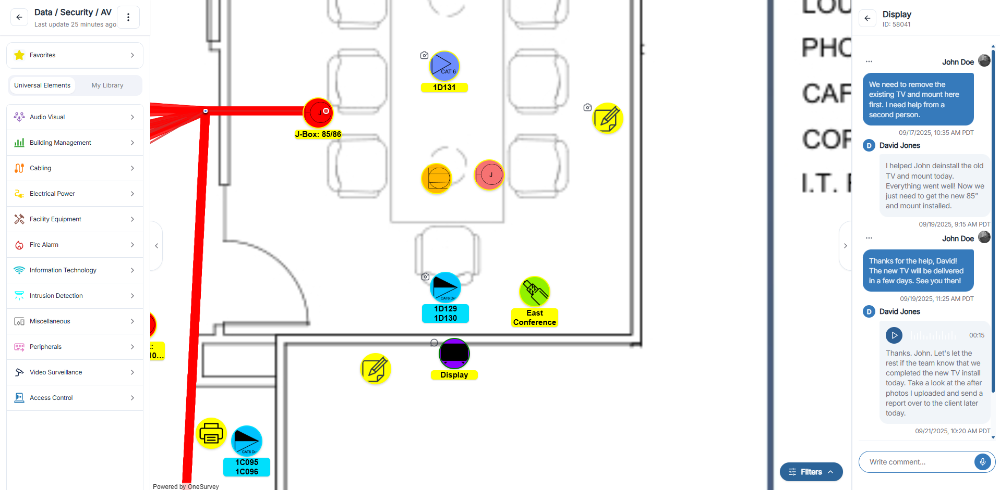
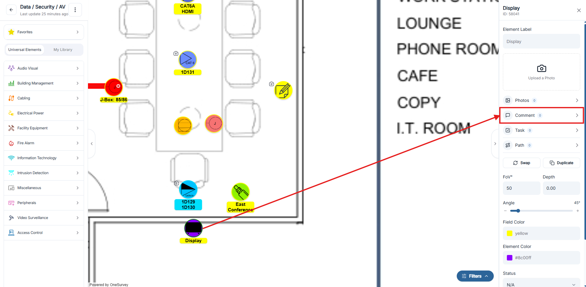
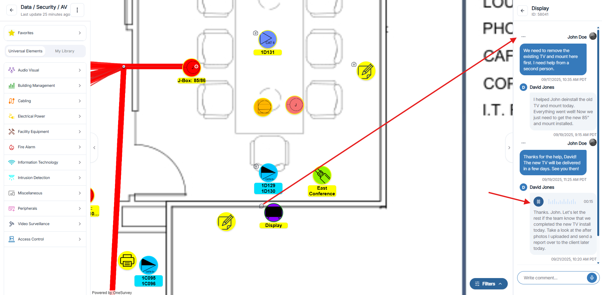
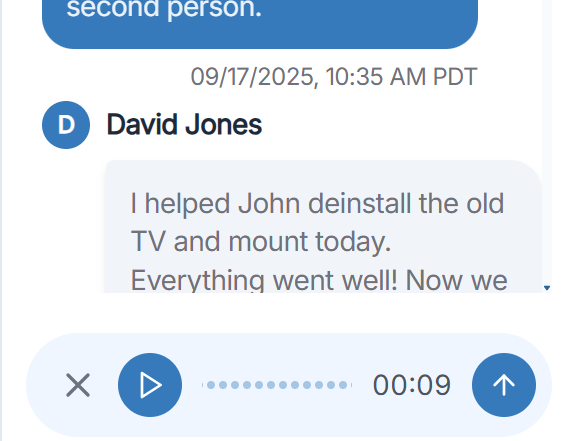

# Commenting

## Overview
Comments keep site conversation connected to the exact element or survey context.

  

    
  

  
Comments panel tied to survey and element context.

## Steps
1. Select the element.
2. Open comments.
3. Add your note.
4. Save so the team can review.

  

    
  

  
Comments tab for reviewing thread history.

  

    
  

  
Use comment actions for follow-up and cleanup.

## Best Practice
Keep comments short, specific, and action-oriented.

  

    
  

  
Preview comments quickly from summary cards.

## Related Pages
- [Element Information](element-information.md)
- [Assignments](../projects/assignments.md)
- [Tickets](../projects/tickets.md)

