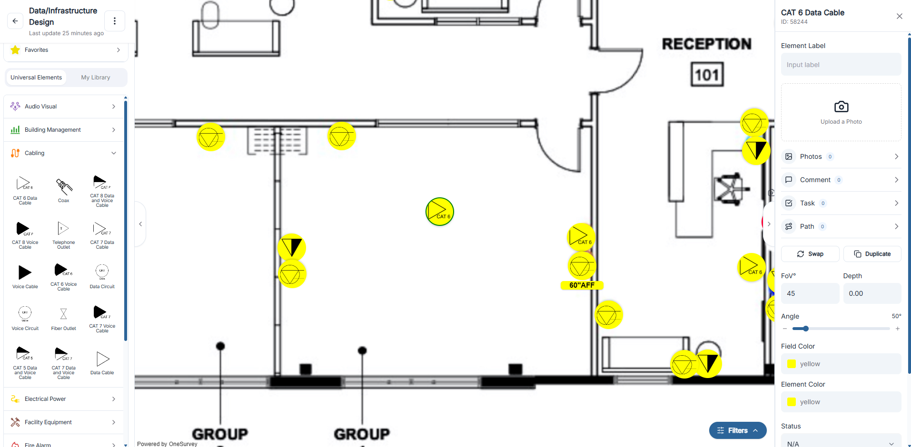

# Drag and Drop Elements

## Overview
Use drag and drop to place elements on the survey canvas.

  

    
  

  
Drag elements from the library directly onto the canvas.

## Steps
1. Open the element library.
2. Drag an element to the canvas.
3. Drop it in the correct location.
4. Open it and complete element information.

## Tips
- Place elements at accurate reference points.
- Use consistent naming for easier review and reporting.

## Related Pages
- [Canvas Workspace Basics](index.md#canvas-workspace-basics)
- [Element Information](element-information.md)

