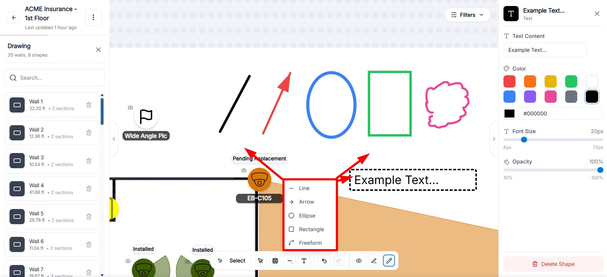

# Drawings and Walls

## Overview
Draw mode helps you add structure and context directly on the floor plan.  
Use it for walls, lines, arrows, shapes, and text notes so teams can review scope and field conditions clearly.

  

    <video controls preload="metadata" playsinline style="width: 100%; height: auto; display: block;" src="../../assets/videos/Draw-mode-walls.mp4">
      Your browser does not support the video tag.
    </video>
  

  
Draw mode walkthrough for creating and adjusting walls and other annotations.

## Draw Tools Available
- **Walls**: create multi-point wall runs and room boundaries.
- **Line**: add straight reference lines.
- **Arrow**: show direction or flow.
- **Ellipse / Rectangle**: call out areas and zones.
- **Freeform**: sketch irregular boundaries or notes.
- **Text**: place editable text labels on the canvas.

  

    
  

  
Shape tools in draw mode for quick visual markup and annotation.

## Draw and Edit Walls
1. Enter draw mode and choose **Walls**.
2. Click or tap to place points.
3. Continue placing points to create multi-segment walls.
4. Select the wall to edit its details in the drawing sidebar.

If you are actively drawing, use **Finish Drawing** when you want to stop adding points.

## Wall Sections and Properties
When a wall is selected, you can edit all sections together or a single section.

- **Section type**: choose from Concrete/Masonry, Metal, Drywall/Wood, Glass, or Other/Unknown.
- **Section name**: add a label for easier review.
- **Color, thickness, opacity**: control visual style for clarity.
- **Length display**: view total wall length or section length.
- **Add Point**: extend or reshape a wall.
- **Delete Section**: remove one section (when a wall has multiple sections).
- **Delete Wall**: remove the wall entirely.

## Work with Shapes and Text
- Use **Line** and **Arrow** for direction and quick callouts.
- Use **Ellipse** or **Rectangle** with **Outline** or **Filled** style for area highlights.
- Use **Freeform** for irregular shapes that do not fit standard geometry.
- Use **Text** to place labels and notes; then edit text content, font size, color, and opacity.

## Best-Practice Workflow
1. Add key walls first.
2. Add shapes and text labels to clarify intent.
3. Adjust visual style (color/thickness/opacity) so markups stay readable.
4. Recheck visibility before handoff.

Walls are used in coverage calculations, while other shapes are visual annotations.

## Related Pages
- [Canvas Workspace Basics](index.md#canvas-workspace-basics)
- [FoV Adjustment](fov-adjustment.md)
- [Visibility Filters](visibility-filters.md)
- [Adding a Path](adding-a-path.md)
