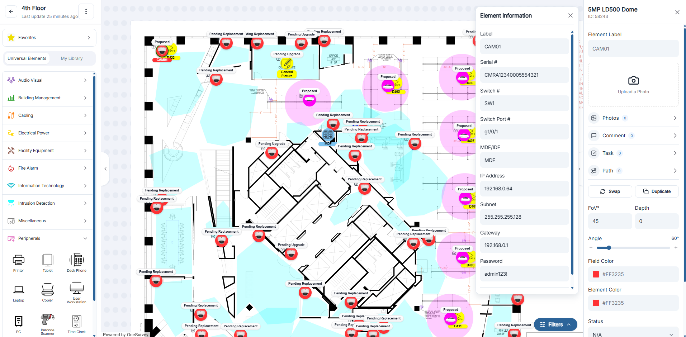

# Surveys Overview

Surveys are where site data comes to life. This module lets you collect floor plans, place system elements, and capture installation details, all inside a visual canvas so your team can collaborate on accurate, up-to-date designs.

  

    
  

  
Metadata, photos, and design tools appear side-by-side in a live survey.

## What You Can Do

- Start new surveys for a project or floor.
- Upload floor plans in PDF or image formats.
- Work on the canvas to drag, drop, and reposition elements.
- Edit element metadata such as labels, colors, and linked photos.

## Typical Workflow

1. Create a Project: set up a project to house your surveys and other site data. See: [Projects Overview](../projects/index.md).
2. Start a Survey: create a survey record tied to that project or floor. See: [Start a Survey](start-survey.md).
3. Upload a Floor Plan: add the blueprint or layout you'll design on. See: [Upload a Floor Plan](upload-floor-plan.md).
4. Use the Canvas: drag elements onto the floor plan, adjust their properties, and switch between floor plans if needed. See: [Canvas Basics](canvas-basics.md).
5. Add Elements & Metadata: document each device with descriptions, installation notes, and links to photos or files. See: [Element Information & Metadata](element-information.md).

## Next Steps

- Create a Project if you haven't already: [Projects Overview](../projects/index.md).
- Upload a Floor Plan to add the layout you'll work on: [Upload a Floor Plan](upload-floor-plan.md).
- Canvas & Floor Plans explains navigation, zooming, and version history: [Canvas Basics](canvas-basics.md), [Version History](version-history.md).
- Elements & Metadata shows how to configure and document each element: [Element Information & Metadata](element-information.md).

Use this overview as your hub for everything related to surveys before diving into each detailed guide.

