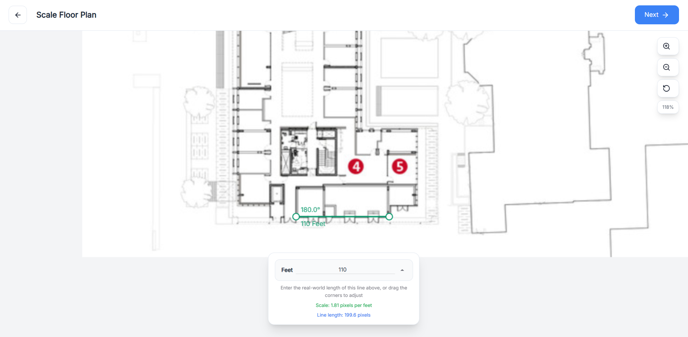

# Surveys Overview

Surveys are where teams create floor plan layouts, place elements, and maintain field-ready site information.

  

    
  

  
Survey list and status overview for a site.

## Most Used

  <a class="os-quick-link" href="upload-floor-plan/" role="listitem">Upload a Floor Plan</a>
  <a class="os-quick-link" href="drag-and-drop/" role="listitem">Drag and Drop Elements</a>
  <a class="os-quick-link" href="design/" role="listitem">Element Sidebar</a>
  <a class="os-quick-link" href="element-information/" role="listitem">Element Information</a>
  <a class="os-quick-link" href="link-photos/" role="listitem">Link Photos</a>

## Canvas Workspace Basics

The canvas is the primary survey workspace for placing elements, adding context, and reviewing progress before handoff.

  

    
  

  
Use the canvas to place elements and update details in context.

### Core Actions
- Pan and zoom to the area you are documenting.
- Select, move, and update placed elements.
- Open the [Element Sidebar](design.md) to manage details, photos, and tickets.
- Switch floor plans or versions as needed.

  

    
  

  
Set floor-plan scale before detailed placement for accurate mapping.

### Practical Workflow
1. Open the target floor plan.
2. Place or select elements on the canvas.
3. Update details in the [Element Sidebar](design.md).
4. Use [Visibility Filters](visibility-filters.md) to validate the final view.

## Guides by Topic

  <section class="os-topic-card">
    <h3>Survey Setup</h3>
    
Set up the canvas and floor plan before detailed field work.

    <ul>
      <li><a href="upload-floor-plan/">Upload a Floor Plan</a></li>
      <li><a href="drag-and-drop/">Drag and Drop Elements</a></li>
      <li><a href="drawings-and-walls/">Drawings and Walls</a></li>
    </ul>
  </section>
  <section class="os-topic-card">
    <h3>Element and Media Work</h3>
    
Place elements and capture the visual context needed for delivery.

    <ul>
      <li><a href="drag-and-drop/">Drag and Drop Elements</a></li>
      <li><a href="element-information/">Element Information</a></li>
      <li><a href="link-photos/">Link Photos</a></li>
    </ul>
  </section>
  <section class="os-topic-card">
    <h3>Quality Control</h3>
    
Review standards and history before sharing results with your team.

    <ul>
      <li><a href="visibility-filters/">Visibility Filters</a></li>
      <li><a href="design/">Element Sidebar</a></li>
      <li><a href="version-history/">Version History</a></li>
    </ul>
  </section>

## Related Pages

- [Sites Overview](../sites/index.md)
- [Mobile Surveys](../mobile/surveys.md)
- [Reports](../sites/reports.md)
- [FAQ](../support/faq.md)
