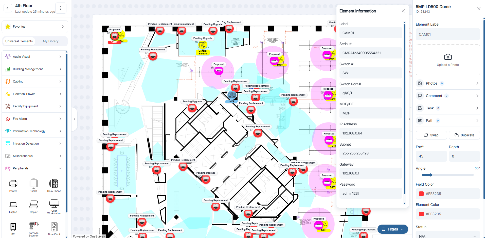

# Surveys Overview

Surveys are where teams create floor plan layouts, place elements, and maintain field-ready site information.

  

    
  

  
Survey list and status overview for a site.

## Most Used

  <a class="os-quick-link" href="start-survey/" role="listitem">Start a Survey</a>
  <a class="os-quick-link" href="upload-floor-plan/" role="listitem">Upload a Floor Plan</a>
  <a class="os-quick-link" href="drag-and-drop/" role="listitem">Drag and Drop Elements</a>
  <a class="os-quick-link" href="element-information/" role="listitem">Element Information</a>
  <a class="os-quick-link" href="link-photos/" role="listitem">Link Photos</a>
  <a class="os-quick-link" href="quality-check/" role="listitem">Quality Check</a>

## Guides by Topic

  <section class="os-topic-card">
    <h3>Survey Setup</h3>
    
Initialize a survey and prepare floor plans for accurate mapping.

    <ul>
      <li><a href="start-survey/">Start a Survey</a></li>
      <li><a href="upload-floor-plan/">Upload a Floor Plan</a></li>
      <li><a href="canvas-basics/">Canvas Basics</a></li>
      <li><a href="drawings-and-walls/">Drawings and Walls</a></li>
    </ul>
  </section>
  <section class="os-topic-card">
    <h3>Element and Media Work</h3>
    
Place elements, maintain details, and attach visual context.

    <ul>
      <li><a href="drag-and-drop/">Drag and Drop Elements</a></li>
      <li><a href="element-information/">Element Information</a></li>
      <li><a href="link-photos/">Link Photos</a></li>
      <li><a href="commenting/">Commenting</a></li>
      <li><a href="adding-a-path/">Adding a Path</a></li>
    </ul>
  </section>
  <section class="os-topic-card">
    <h3>Quality and Control</h3>
    
Manage visibility, design standards, and review history before delivery.

    <ul>
      <li><a href="visibility-filters/">Visibility Filters</a></li>
      <li><a href="design/">Design and Color</a></li>
      <li><a href="survey-settings/">Survey Settings</a></li>
      <li><a href="version-history/">Version History</a></li>
      <li><a href="quality-check/">Quality Check</a></li>
    </ul>
  </section>

## Related Pages
- [Sites Overview](../projects/index.md)
- [Mobile Surveys](../mobile/surveys.md)
- [Reports](../projects/reports.md)
- [FAQ](../support/faq.md)
