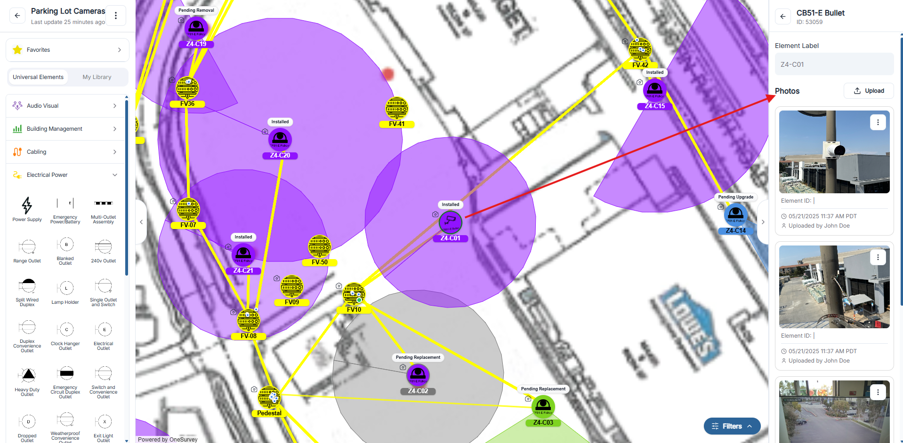
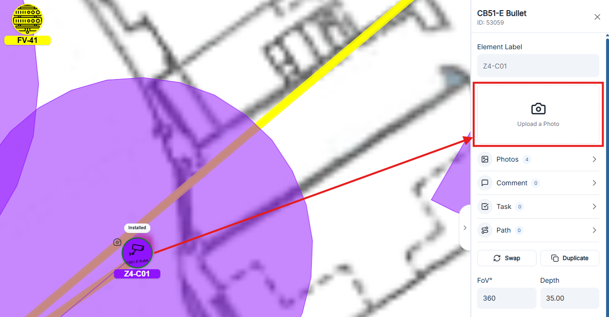

# Uploading Photos

Attach site imagery directly to elements so every device on the canvas carries visual context. The Photos tab in an element’s detail panel lets you upload images, annotate them, and manage stage/element assignment.

  

    
  

## Add a photo to an element
1. Select an element on the survey canvas to open its detail sidebar.
2. Tap the "Upload a Photo button" or switch to the Photos tab.
3. If uploading from the photos tab, click Upload to open the file picker (multiple selection supported).
4. Choose image files and confirm (.png. .jpeg, .jpg, .webp, or .heic supported).
5. Upload progress shows as temporary placeholder cards until each image finishes.
6. Each successful upload appears as a card with the photo, element ID/name, timestamp, and uploader.

## Quick upload from the main sidebar
When an element is selected, the main (left) sidebar shows an Upload a Photo button. Use this for a single image you want to attach quickly without opening the full Photos tab. The photo links immediately to the active element.

  

    
  

## Photo options menu
Open the ⋮ (more) menu on any photo card for additional actions:

- Open: preview the image in a larger viewer.
- Annotate: launch a markup editor to draw, add callouts, or notes.
- Move photo: reassign the photo to another element; search for a destination and confirm.
- Change stage: tag the photo with a workflow stage (Profile, Pre-Design, Take Off, Design, Deployment, LiveBuilt) for reporting and organization.
- Delete: permanently remove the photo from the element.

## Tips
- Bulk uploads: the Photos tab accepts multiple images at once; they upload sequentially with brief delays.
- Stage management: apply stages consistently so reports group photos by project phase.
- Reassignment: if a photo was attached to the wrong element, use Move photo instead of re-uploading.
- Quick shots: in the field, select an element and use Upload a Photo to log single images on the fly. 
- Review: All photos taken across all survey will be collected in the [Gallery](../projects/project-photos.md).
