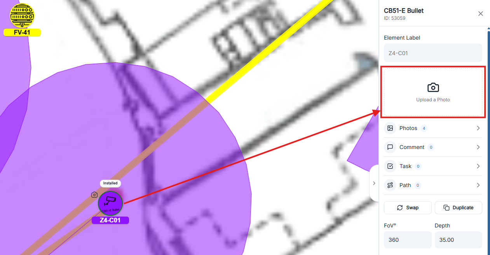
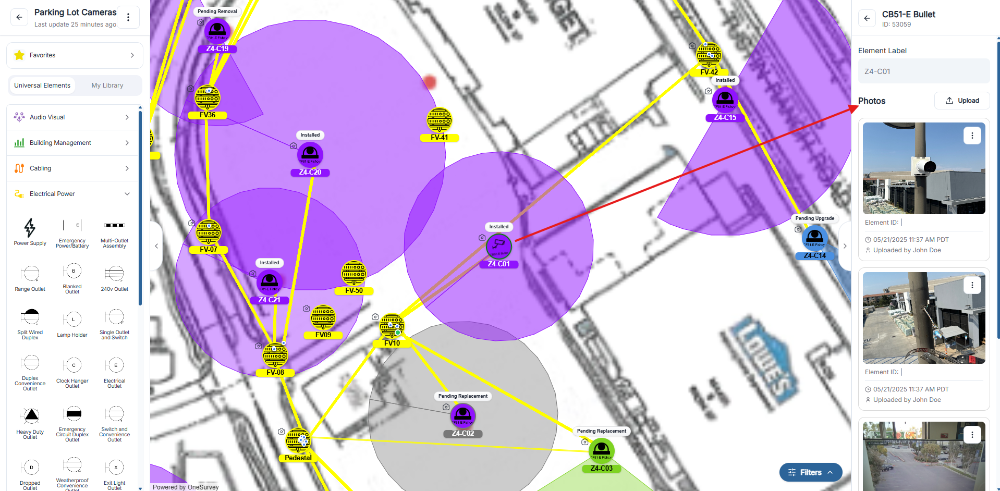

# Link Photos

## Overview
Link photos to elements to keep visual documentation tied to the exact location.

  

    <video controls preload="metadata" playsinline style="width: 100%; height: auto; display: block;" src="../../assets/videos/Tablet-Photo-Upload.mp4">
      Your browser does not support the video tag.
    </video>
  

  
Tablet photo upload workflow for linking photos to the correct element.

## Steps
1. Select an element.
2. Open element photos.
3. Upload one or more images.
4. Confirm the images are linked to the correct element.

  

    
  

  
Upload photos directly from the linked element workflow.

## Common Actions
- Preview photos.
- Annotate photos.
- Move a photo to another element.
- Remove photos.

  

    
  

  
Photo menu options for preview, edits, and re-linking.

## Related Pages
- [Gallery](../sites/gallery.md)
- [Commenting](commenting.md)

