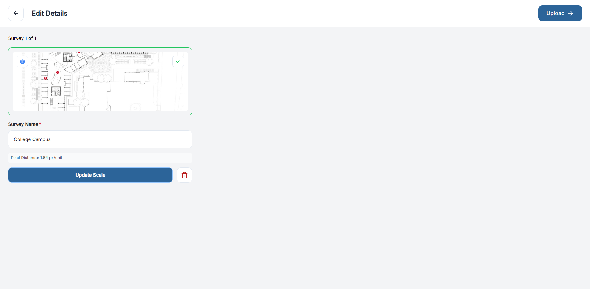
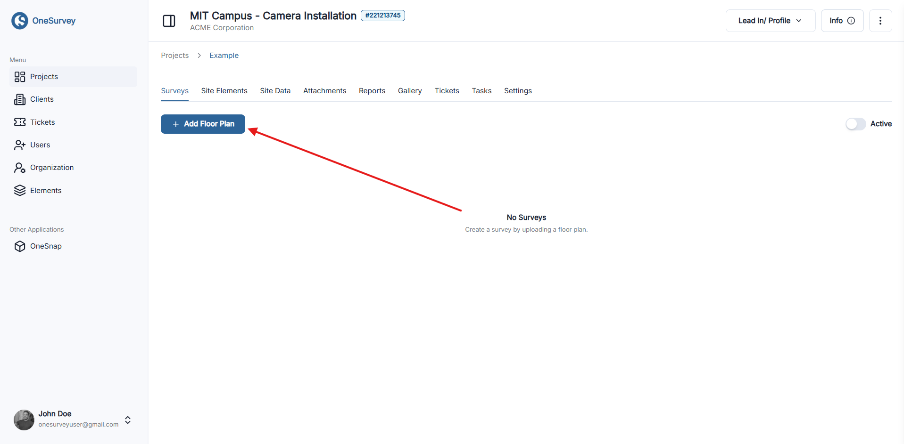

# Upload a Floor Plan

## Overview
Upload the floor plan image or drawing used as the survey background.

  

    
  

  
Upload a floor plan as the survey base layer.

## Steps
1. Open the survey.
2. Select **Upload Floor Plan**.
3. Choose your file.
4. Confirm upload.
5. Set scale for accurate measurements.

  

    
  

  
Use the Upload Floor Plan action from the survey toolbar.

## Tips
- Use clear, high-quality files.
- Use clear names for multi-floor sites.
- Confirm scale before placing many elements.

## Related Pages
- [Canvas Basics](canvas-basics.md)
- [Surveys Overview](index.md)

