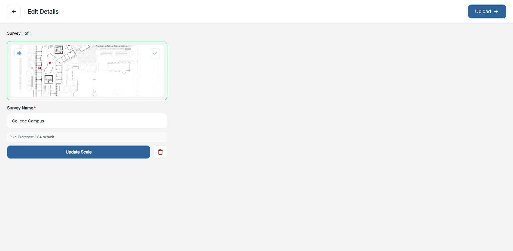

# Upload a Floor Plan

Adding floor plans is the first step toward mapping devices on the canvas. OneSurvey supports PDF or image files, allowing teams to design directly on accurate backgrounds.

## Uploading a New Floor Plan

1. Open the Surveys tab in your project.
2. Click Add Floor Plan (the `+` icon) to launch the upload modal.
3. Enter a clear name for the floor plan.
4. Choose your file (PDF, JPG, or PNG) and confirm.
   - For PDFs, the first page becomes the background.

  

    
  

## Measuring & Setting Scale

Calibrate the plan so all distances are accurate:

1. Double-click to drop the first ruler point.
2. Drag the ruler across a known reference point (e.g., across a doorway).
3. Enter the real-world distance (e.g., "3 ft") when prompted.

Example: measure a door's width at 3 ft to ensure path lengths or camera field-of-view depths are calculated correctly.

  

    
  

Click Upload to add the plan to your project. The floor plan appears as a card with its name, last-updated date, and a thumbnail preview. Select the card to open it on the canvas.

  

    
  

## Managing Floor Plans

Each floor plan card includes a dropdown menu for additional actions:

| Action | Description |
| --- | --- |
| Rename | Update the floor plan's title. |
| Transfer | Move the file to another project. |
| Duplicate | Create a copy for alternate layouts or revisions. |
| Archive / Unarchive | Hide or restore the plan without deleting it. |
| Delete | Permanently remove the plan. This action cannot be undone. |

Use the Active / Archived toggle at the top of the page to switch between current and archived plans.

## Tips

- Keep file sizes reasonable (under 20 MB) for faster loading on the canvas.
- Use high-resolution images to maintain clarity when zooming in.
- Archive old floor plans instead of deleting them to preserve revision history.

With your floor plan uploaded, you're ready to start placing elements on the canvas and documenting the site in detail.

