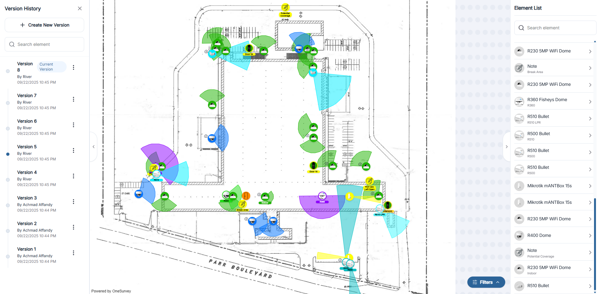

# Version History

## Overview
Version History lets you review and restore previous survey states.

  

    
  

  
Review snapshots and restore previous survey versions.

## Steps
1. Open Version History.
2. Review saved versions.
3. Restore a version when needed.

## Why It Helps
Version history provides a clear change trail and a safe rollback option.

## Related Pages
- [Canvas Basics](canvas-basics.md)

