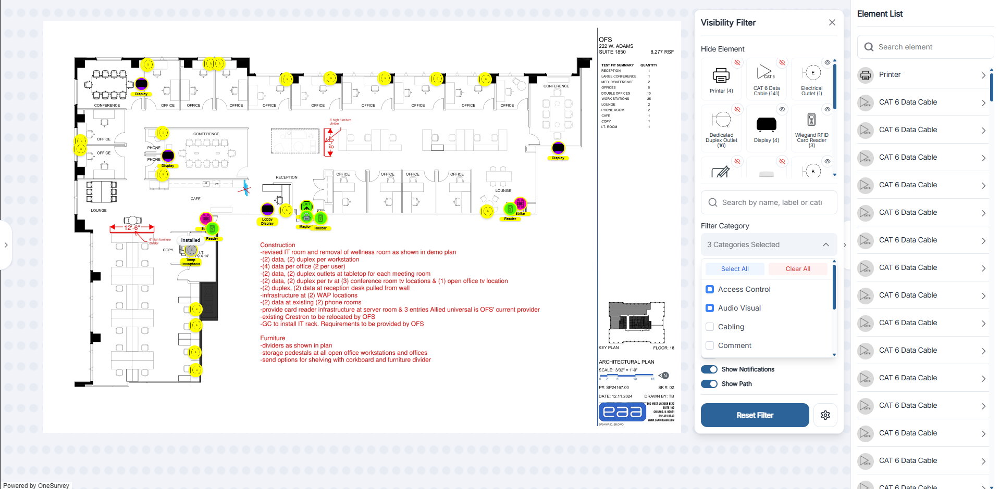

# Visibility Filters

The Visibility Filter lets you focus on specific elements while working on a survey canvas. Toggle it using the floating Filter button at the bottom of the canvas.

  

    
  

## Opening the Filter Panel

1. Click the round Filter button hovering near the bottom center of the canvas.
2. The Visibility Filter modal appears with two tabs: View Mode and Edit Mode (default).

## Filter Options

### Hide Element
Toggle the Hide Element switch to temporarily hide an individual element (for example, when editing its properties).

### Search by Label
Use the Search by label field to quickly find elements by their text label.

### Filter Category
Two Filter Category dropdowns let you narrow visible elements by category or subcategory.

- Selecting “All Category Filtered” shows every element; choosing a category hides the others.

### Totals
Live counters indicate how many element types are present, hidden, and visible.

### Display Toggles

- Show Number — display or hide element numbers on the canvas.
- Show Notifications — toggle alert icons for elements requiring attention.
- Show Path — reveal or hide paths associated with certain element types (for example, cable runs).

### Reset Filter
Click Reset Filter to clear all filter settings and show every element again.

## View & Edit Mode

View mode: Switch to View Mode for a simplified read-only view of the elements on the canvas. Elements are listed with minimal controls so you can view without extra options.
Edit mode: Enable full edit capability including the ability to move element positioning, upload photos, drag & drop new elements, update version history, & more.

## Tips

- Use filters to reduce clutter before taking screenshots or generating [Reports](../projects/reports.md).
- If an element “vanishes,” verify that its category isn’t hidden in the filter.
- Filters reset when you refresh or close the survey unless saved via advanced settings.

With the Visibility Filter, you can instantly tailor the canvas to show only the elements you need — keeping your workspace clear and focused. For navigation and placement, see [Canvas Basics](canvas-basics.md) and [Drag & Drop Elements](drag-and-drop.md).
