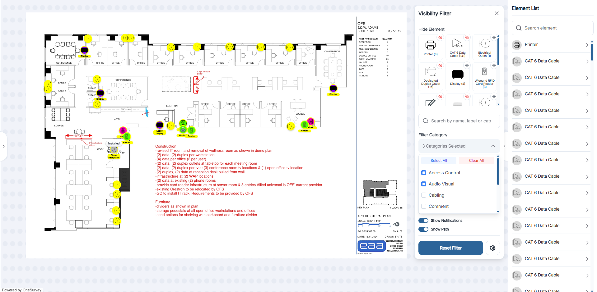

# Visibility Filters

## Overview
Visibility Filters help you focus on the elements that matter for the task in front of you.
Use them to quickly switch between different system layouts and reduce visual noise on dense floor plans.

  

    <video controls preload="metadata" playsinline style="width: 100%; height: auto; display: block;" src="../../assets/videos/different-system-layouts.mp4">
      Your browser does not support the video tag.
    </video>
  

  
Switch between filtered system views to review the same survey from different layout perspectives.

## What You Can Filter
- **Hide Element**: hide specific element types from the canvas using the element tiles in the filter panel.
- **Search**: find elements by element name, element label, or category.
- **Filter Category**: include only selected categories; this supports both shared and organization-specific libraries.
- **Installation Status**: filter by status values:
  - Installed
  - Proposed
  - Pending Replacement
  - Pending Upgrade
  - Pending Removal
  - N/A

## Display Toggles
- **Show Number**: show or hide each element's number badge.
- **Show Notifications**: show or hide badges for photos, comments, assignments, and open tickets.
- **Show Path**: show or hide route/path overlays on the canvas.

These are display controls only and do not delete or change your saved survey data.

## Filter Panel Reference

  

    
  

  
Visibility Filter panel with element, category, status, and display controls.

## Recommended Workflow
1. Open **Visibility Filter** from the survey canvas.
2. Hide unrelated element types first.
3. Narrow by category and installation status.
4. Toggle numbers, notifications, or paths based on what you are reviewing.
5. Use **Reset Filter** to return to the full default view.

## Related Pages
- [Survey Overview](index.md)
- [Element Sidebar](design.md)
- [Element Information](element-information.md)
- [Adding a Path](adding-a-path.md)

